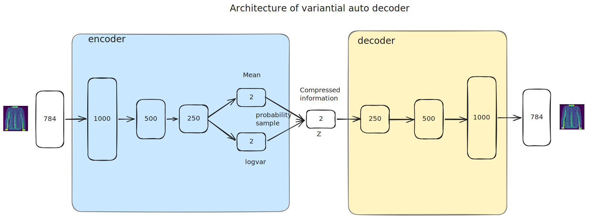

# Variational Autoencoder for Fashion-MNIST

This project trains a Variational Autoencoder (VAE) in PyTorch to reconstruct and generate Fashion-MNIST images. Fashion-MNIST has the same image shape as MNIST, but the classes are clothing items such as shirts, shoes, bags, and coats.

The notebook follows the same lightweight style as [`williamcfrancis/Variational-Autoencoder-for-MNIST`](https://github.com/williamcfrancis/Variational-Autoencoder-for-MNIST), adapted for Fashion-MNIST.

## Architecture

The model uses a fully connected encoder and decoder:

- Encoder: flattens each `28 x 28` image and maps it to a low-dimensional latent Gaussian distribution.
- Latent space: the notebook uses `n_components = 2`, which makes the latent space easy to visualize.
- Decoder: maps a latent vector `z` back into a `28 x 28` image.



## Notebook

Open and run:

[`VAE_FashionMNIST_PyTorch.ipynb`](VAE_FashionMNIST_PyTorch.ipynb)

The notebook includes:

- Fashion-MNIST loading with `torchvision`
- VAE encoder and decoder
- the reparameterization trick
- closed-form KL divergence for the latent Gaussian
- reconstruction and random generation examples
- a latent grid visualization
- custom user-defined `z` values to see what the decoder generates

## Run

Install the dependencies:

```bash
pip install -r requirements.txt
```

Then open the notebook in Jupyter, VS Code, or Google Colab and run the cells in order.

## Custom latent vectors

Near the end of the notebook, edit `custom_z`:

```python
custom_z = [
    [0.0, 0.0],
    [1.0, 0.0],
    [0.0, 1.0],
    [-1.0, 0.0],
]
```

Each row is one latent vector. Because the notebook uses a 2D latent space, each `z` has two values.

## License

This project is licensed under the MIT License.
